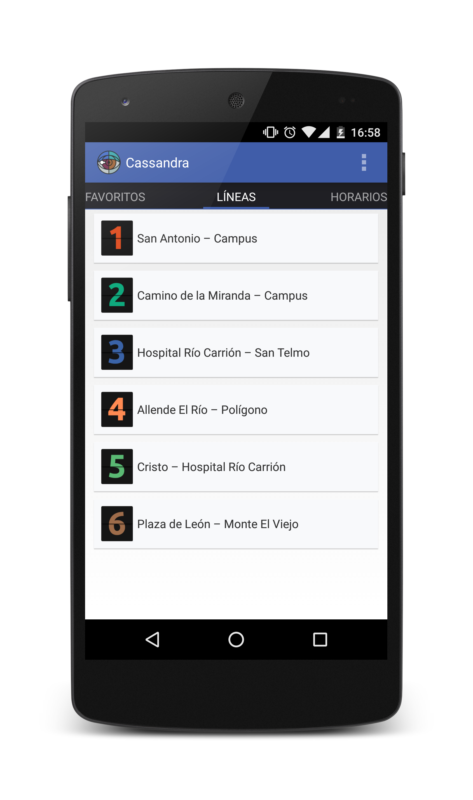

<body class="animated fadeIn">
  <!--div class="announcement animated delayed fadeInDown">
    <h3>Some important announcement<a href="">...</a></h3>
  </div-->

  

    

      

        Cassandra
        
        <h2>Autobuses de Palencia</h2>
        
Consulta los horarios de los autobuses urbanos de <strong>Palencia</strong> desde tu móvil.

        
      

      

        <a class="twitter" href="https://play.google.com/store/apps/details?id=org.coyotev.cassandra">Descarga</a>
        <a class="support" href="http://github.com/enrmarc/cassandra">GitHub</a>
        <a class="legal" href="#">Info</a>
      

    

    

      

        

          
          <!--video class="video--app" id="" autoplay="" muted="" preload="auto">
            <source src="images/video.mp4" type="video/mp4">
          </video-->
        

      

      

        
          © 2013
          <a class="twitter" href="http://github.com/enrmarc">enrmarc</a>
        
      

    

  

  
  

  
  
</body>